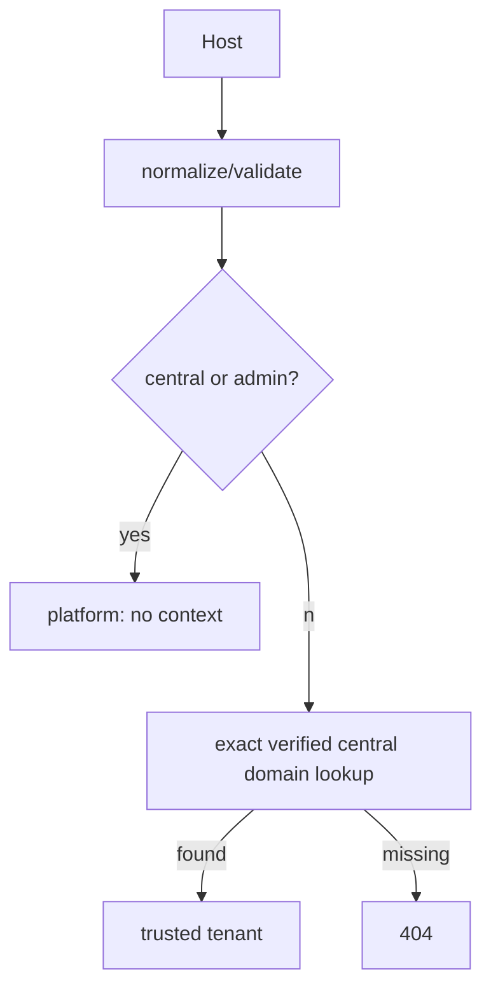

# Domain resolution
Hosts are lowercased, ports removed, and validated. Central/admin configured domains resolve as platform (never tenant). Every other host requires an exact verified and active record in the central `domains` table; unknown, disabled, pending, malformed, and unverified hosts fail closed. Reserved subdomains are prevented during domain creation/provisioning.

