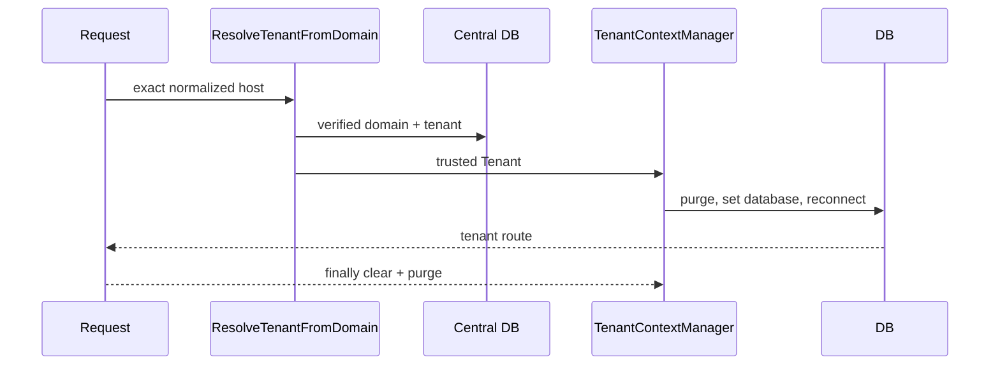

# Runtime tenant context
`TenantContextManager` accepts only a hydrated central `Tenant`, configures the named `tenant` connection using its persisted `database_name`, purges/reconnects it, and clears/purges it in request and job finally blocks. Tenant models explicitly request that connection and throw before initialization. No credential is stored in context or a job payload.

