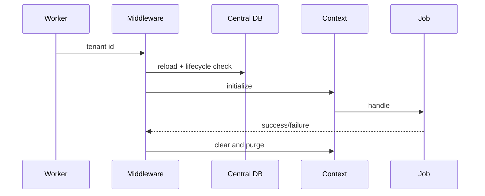

# Tenant-aware queues, cache, and files
Tenant jobs implement `TenantAwareJob` and serialize only a tenant ID. Middleware reloads and revalidates the central record, initializes context, and clears it in `finally`. `TenantCacheKey` prefixes immutable tenant ID. `TenantPrivatePath` writes only below `storage/app/private/tenants/{id}` and rejects traversal.

