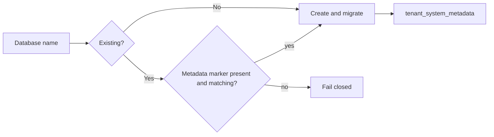

# Tenant database ownership

```mermaid
flowchart LR
 A[Database name] --> B{Existing?}
 B -->|No| C[Create and migrate]
 B -->|Yes| D{Metadata marker present and matching?}
 D -->|yes| C
 D -->|no| E[Fail closed]
 C --> F[tenant_system_metadata]
```

An existing unmarked or mismatched database is never attached or dropped automatically.
