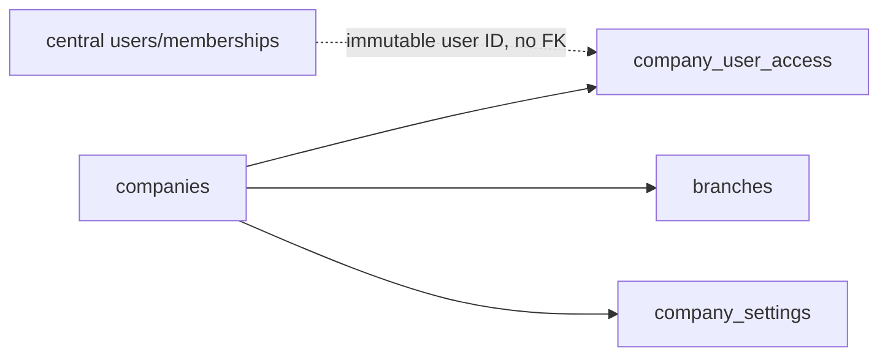

# Tenant foundation schema
Tenant migrations under `database/migrations/tenant` are the only migrations run against tenant connections. They create only currencies, companies, branches, constrained company settings, company user access, and append-only tenant audit logs.

`company_user_access.user_id` deliberately has no cross-database foreign key. Company/branch deletion is unavailable from the model/UI foundation; archive status is used instead.
