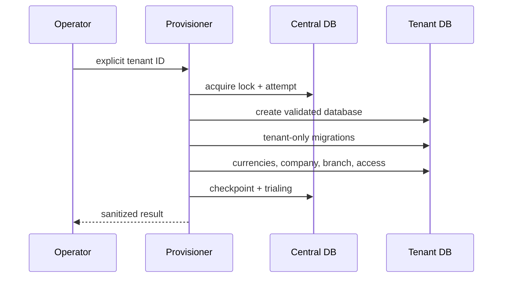
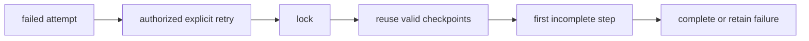

# Tenant Provisioning Architecture

Provisioning is idempotent, locked, auditable, and safe to retry.

## Workflow
1. Validate tenant request.
2. Create central tenant record.
3. Create or attach owner user.
4. Create owner membership.
5. Reserve primary domain.
6. Generate safe tenant database name.
7. Set provisioning status.
8. Create tenant database.
9. Run tenant migrations.
10. Seed tenant roles and currencies.
11. Create default company.
12. Create default branch.
13. Assign company access.
14. Record completed steps.
15. Mark tenant trialing or active.
16. Write platform audit event.

## Reliability
Use an idempotency key and a central lock per tenant/domain. Each step records completion before moving forward. Retries skip completed steps and resume at the first incomplete step.

## Failure states
`provisioning_failed` records sanitized error code, failed step, retryable flag, and operator notes. User-visible errors never expose database names, SQL, credentials, or stack traces.

## Compensating actions
If database creation succeeds but migrations fail, keep the tenant in `provisioning_failed` for repair. Do not automatically drop databases unless an operator-approved cleanup confirms no user data exists.

## Database privileges
Provisioning workers require least-privilege ability to create/drop tenant databases only in the configured prefix namespace and run tenant migrations.

## Safe database names
Format: `nax_tenant_{environment}_{tenant_uuid_without_dashes}` or equivalent generated identifier. Never concatenate raw company, tenant, email, or domain input.

## Phase 1.4 implementation
`TenantProvisioner` is the sole workflow coordinator. It acquires `tenant-provisioning:{id}`, persists stable `ProvisioningStep` checkpoints, and creates a new attempt that inherits prior successful checkpoints. It always clears `TenantContextManager` in `finally`; it does not delete a database on failure.

