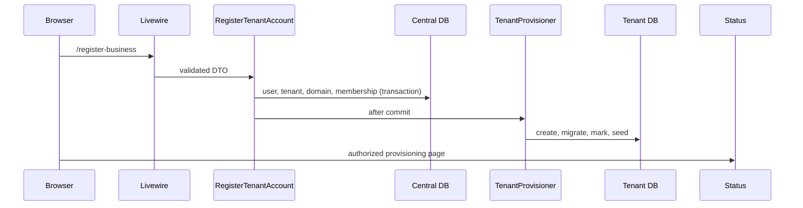

# Tenant self-registration

The customer is redirected to the tenant login rather than silently sharing a central session across subdomains. Queue mode is reserved for deployment with a configured worker; `sync` is suitable only for local setup.
