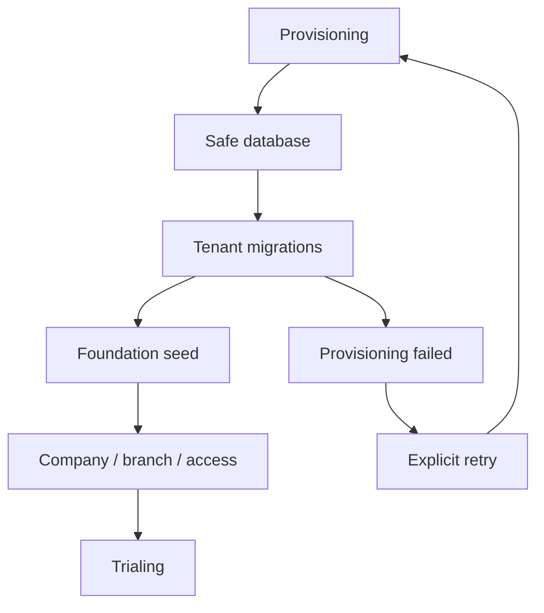

# Phase 1.4 completion report
## Result: CONDITIONAL GO

The source implementation adds a service-driven locked/checkpointed provisioning workflow, separate database creator credentials, dedicated tenant migrations, idempotent BDT/USD foundation seed, default company/branch, owner company access and tenant audit events. It intentionally does not implement fiscal years, accounting periods, tenant RBAC, invitations, business modules, billing, or Phase 1.5.

Runtime validation is conditional because `vendor/` is unavailable in the sandbox. Local MySQL/MariaDB integration tests must validate real DDL privileges, lock storage, migration execution and cross-database isolation before production use. The platform/tenant CRUD screens and comprehensive integration tests remain a delivery blocker: this constrained source increment exposes safe commands and domain foundation but does not claim full UI/test acceptance.

