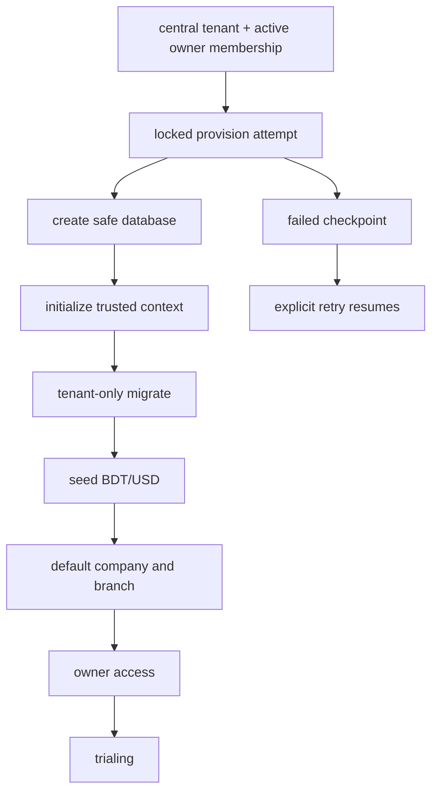

# Local tenant provisioning
Create a disposable central MySQL/MariaDB database and two distinct users. The provisioning user needs `CREATE` on the server and normal schema access only for the approved `nax_tenant_` namespace operational process; the runtime tenant user needs DDL/DML on tenant schemas but **not** `CREATE DATABASE`.

Set `CENTRAL_DB_*`, `TENANT_DB_*`, and `PROVISIONING_DB_*` in `.env`; do not put credentials in source. Run central migrations first, create a central tenant with its active owner membership, then run `php artisan tenant:provision <tenant-id>`.

Validation: `composer validate`, `php artisan migrate:status --database=central`, `php artisan tenant:provision 1`, `php artisan test`, `vendor/bin/pint --test`, `vendor/bin/phpstan analyse`, and `npm run build`.
